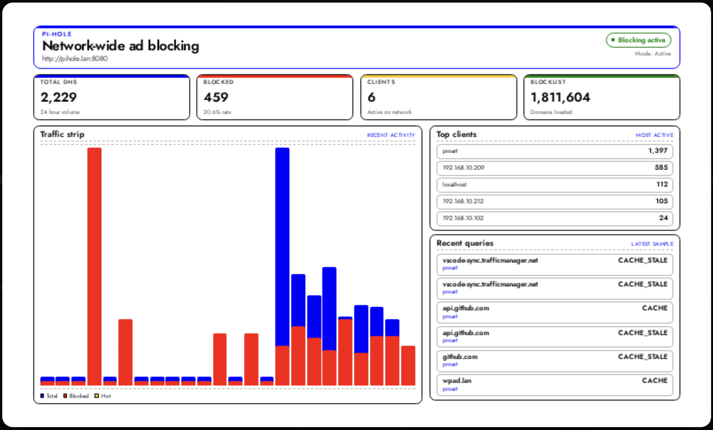
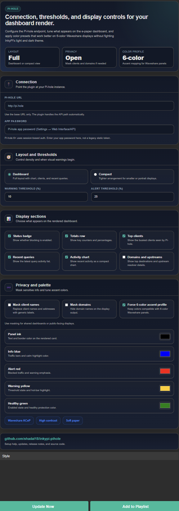

# InkyPi Pi-hole Dashboard

An plugin that shows Pi-hole status information on an InkyPi display with a clean, glanceable layout and configurable display fields.

_Pi-hole Dashboard_ is a plugin for [InkyPi](https://github.com/fatihak/InkyPi) that displays DNS and blocking information from your Pi-hole setup.

## Install

Use the InkyPi plugin installer with the plugin ID and this repository URL, following the install pattern shown by the official InkyPi plugin template.

```bash
inkypi plugin install pihole_dashboard [https://github.com/shadal18/inkypi-pihole-dashboard](https://github.com/shadal18/inkypi-pihole-dashboard)
```

## Update

To update the plugin on your InkyPi device:

1. SSH into your InkyPi host.
2. Change into the plugin directory:
   ```bash
   cd ~/InkyPi/src/plugins/pihole_dashboard
   ```
3. Run this update command:
   ```bash
   git pull origin main && \
   if [ -d pihole_dashboard ]; then \
     rsync -a pihole_dashboard/ ./ && \
     rm -rf pihole_dashboard; \
   fi && \
   sudo systemctl restart inkypi.service
   ```

If you don’t see your changes after updating:

- Confirm you are in the correct plugin folder.
- Clear your browser cache or hard refresh the InkyPi web UI.
- Check the InkyPi logs for any plugin errors.

## Requirements

- A reachable Pi-hole instance with its API available over HTTP or HTTPS.
- Network access from the InkyPi device to the Pi-hole host.
- An API token if your Pi-hole configuration requires authenticated API access.

## Features

This plugin is an extension for the InkyPi e-paper display frame and includes the following features.

- Shows current Pi-hole blocking status.
- Displays total DNS query count.
- Displays blocked query count and blocked percentage.
- Displays unique client count.
- Displays blocklist domain count.
- Optional top clients display.
- Optional recent query display.
- Optional recent activity chart.
- Optional top domains and upstream destination display.
- Clean layout optimized for quick glance reading on e-paper.
- Pi-hole-focused design with no local Pi-hole tools required on the InkyPi device.

## Settings

The plugin settings page lets you customize:

- Pi-hole URL.
- API token.
- Show or hide status.
- Show or hide totals.
- Show or hide top clients.
- Show or hide recent queries.
- Show or hide the recent activity chart.
- Show or hide top domains and upstreams.
- Show or hide client names.
- Show or hide queried domains.

## Repository

GitHub repository:

[https://github.com/shadal18/inkypi-pihole-dashboard](https://github.com/shadal18/inkypi-pihole-dashboard)

## Screenshots

- Pi-hole Dashboard plugin.
- Settings.

<p align="center">
  
  
</p>
